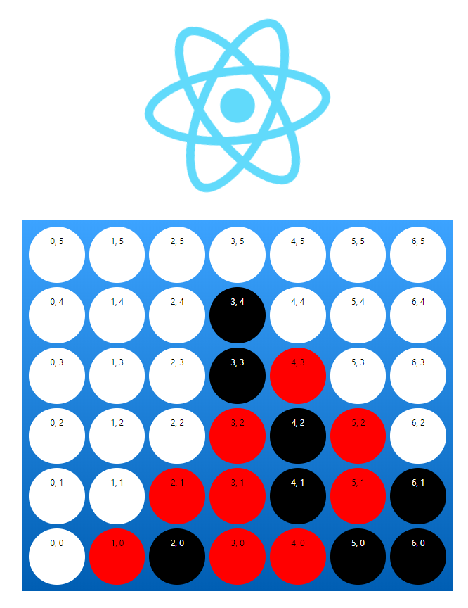

Simple Connect Four with React Javascript

Copied from Luke Segar's video https://www.youtube.com/watch?v=b0O3i4AyoE0.
My version is simplified to not include Redux so state is tranfered directly between the App.js React Component and the GridCell.js React Component.  
Also, I made one simple enhancement to convert the pieces to circles with border-radiuses in the App.css cell.

Start with:
npx create-react-app connect-four

Run with:
npm start

